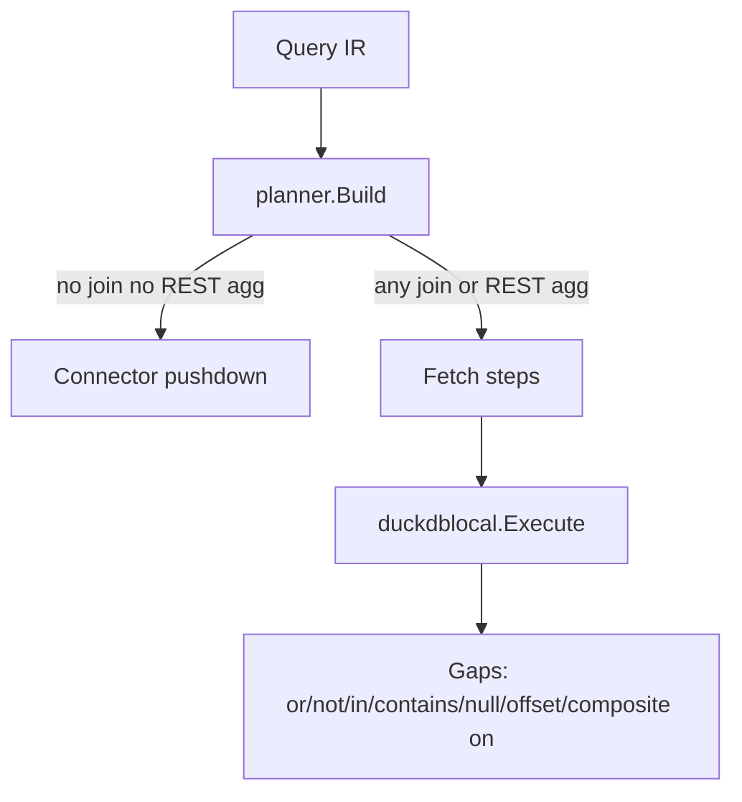

# DuckDB readiness and migration

## Verdict first: local ops are not fully working

Today `meta.plan.usedDuckDB` means **pure Go** [`internal/duckdblocal`](internal/duckdblocal/engine.go), not embedded DuckDB. For IR features that force the local path (any join; REST + agg), **not all protocol ops behave correctly**.

| Area | Status in pure Go engine | Risk |
|------|--------------------------|------|
| Join `inner` / `left` | Works (nested loop; equality via `fmt.Sprint`) | OK for MVP fixtures |
| Agg `count/sum/avg/min/max` + `groupBy` | Works | OK |
| `orderBy` + `limit` | Works | OK |
| Where `eq/neq/gt/gte/lt/lte` + `and` | Works | OK |
| Where `in/nin/contains/is_null/not_null` | **Silent pass** (`compare` default `true`) | **Incorrect results** |
| Where `or` / `not` | **Dropped** by `flattenPreds` in [`executor.go`](internal/executor/executor.go) | Filters disappear |
| `offset` | Planner stores it; **local `QuerySpec` ignores it** | Wrong pagination |
| Composite join `on` (multi-key) | Emitted as **separate** join steps, not AND on one join | Wrong join semantics |
| Same-source SQL join pushdown | Spec says yes for pg/mysql; code always sets `UseDuckDB` on any join | Extra local fetch |

Coverage today: one unit test ([`engine_test.go`](internal/duckdblocal/engine_test.go) multi-join+agg). Golden join fixtures exist (`fixtures/queries/*_join.json`) but are **not** automated against the local engine.

**Conclusion:** Do **not** swap to DuckDB until local-path semantics match IR (or DuckDB backend implements the full IR op set and executor stops silently dropping predicates). Otherwise you migrate a broken contract.

---

## Phase 0 — Make “needed ops” actually work (before DuckDB)

Fix the pure Go engine + executor so the local path is honest and complete for protocol 0.1.0:

1. **Fail closed on unsupported local where:** in `flattenPreds` / engine `compare`, return `UNSUPPORTED` (or reject at validate when `UseDuckDB`) for `or`, `not`, `in`, `nin`, `contains`, `is_null`, `not_null` until implemented — stop silent match/drop.
2. **Implement remaining where ops** in `duckdblocal` (preferred for parity with SQL/Mongo connectors) *or* document + enforce UNSUPPORTED until DuckDB owns them.
3. **Add `Offset` to `QuerySpec`** and apply after order/limit logic (limit after offset).
4. **Composite join ON:** one `JoinSpec` with multiple equality pairs (AND), not N separate joins — change [`buildLocalSpec`](internal/executor/executor.go).
5. **Tests:** expand `engine_test.go` matrix (where ops, offset, left/inner, composite on); add planner/executor tests that `UseDuckDB` fixtures assert correct filters; optionally wire golden `*_join.json` in a small Go test with mocked tabular materialization.

Lock decision for Phase 0: **implement missing where ops + offset + composite ON in pure Go**, and only then introduce DuckDB. That keeps CI green without CGO.

---

## Phase 1 — What is needed to move to real DuckDB

Keep the stable façade D01 already assumes: `Open` / `Materialize` / `Execute` / `Close` on a small interface.

### Approach (locked)

- Introduce `type Engine interface { ... }` in `internal/duckdblocal`.
- **Default build (`!cgo` or build tag `pure`):** current Go engine (after Phase 0).
- **DuckDB build (tag `duckdb` + CGO):** new file(s) e.g. `engine_duckdb.go` using `github.com/duckdb/duckdb-go/v2`:
  - `Materialize` → `CREATE TEMP TABLE` / `INSERT` (or Arrow/Appender)
  - `Execute` → generate **parameterized** SQL from `QuerySpec` (not agent IR), run via DuckDB
  - Map all Phase-0 ops: joins, where (including in/contains/null/or), agg, groupBy, orderBy, limit, offset
- Wire [`executor.go`](internal/executor/executor.go) to `duckdblocal.Open()` only (factory picks impl via build tags).
- Restore dependency only under the DuckDB tag / document `go build -tags duckdb`.
- Windows: reuse existing [`duckdblib/`](duckdblib/) + [`scripts/dev/dev-shell.ps1`](scripts/dev/dev-shell.ps1); restore a smoke test under `scripts/` (not gitignored `tmp/`).
- Linux/macCI: install libduckdb or use duckdb-go bindings’ platform libs.

### SQL generation rules (DuckDB backend)

- Identifiers quoted; values bound as parameters (same security bar as `sqlbuild`).
- Typed compares where `protocol.Column.Type` is known (avoid `fmt.Sprint` equality).
- `usedDuckDB: true` remains the “local compute” flag (name historical; optionally add `localEngine: "go"|"duckdb"` later — **not** required for first swap).

### Non-goals for first DuckDB cut

- Same-source SQL join pushdown (planner still may fetch+local; optimize later).
- Replacing pushdown connectors with DuckDB scans.
- Making DuckDB the default Windows binary (keep pure Go default per D01).

---

## Phase 2 — Validation checklist (“all ops working”)

Before calling DuckDB migration done:

- [ ] Unit: every CompareOp + `and`/`or`/`not` on local path (Go and, when tagged, DuckDB)
- [ ] Unit: inner/left, composite ON, aggs, groupBy, orderBy, limit, offset
- [ ] Integration: `fixtures/queries/invoices_customers_join.json` and `events_customers_join.json` against harness (or table-driven with fake connector rows)
- [ ] Negative: unsupported paths return typed `UNSUPPORTED`, never silent filter drop
- [ ] `go test` (pure) green without CGO; `go test -tags duckdb` green with toolchain

---

## Suggested order of work

1. Phase 0 gap-close + tests (pure Go) — **blocks** honest DuckDB move  
2. Extract `Engine` interface; keep Go as default  
3. Implement DuckDB backend behind `-tags duckdb`  
4. Document build/run (README + roadmap note); smoke script using `duckdblib` on Windows  
5. (Later) same-source join pushdown; optional default DuckDB on Linux CI only
