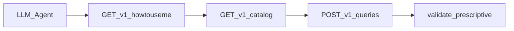

# Plano: Query IR fácil para qualquer LLM

## Diagnóstico (decisão de produto)

A linguagem 0.1.0 **já tem** `BoolExpr` com `{op:"and"|"or"|"not", args:[...]}` no schema e em [planning/03-protocol-schemas.md](planning/03-protocol-schemas.md). O GPT falhou porque inventou `{ "and": [...] }` (shape Mongo) e porque `/v1/howtouseme` hoje não mostra isso com força.

**Default deste plano:** não mudar a gramática do IR; mudar a **superfície de descoberta + autocorreção**. Não exigir `relations[].on` no validador (ainda hints; inventar FK continua semanticamente possível se campos existirem — o guia diz Never invent).

## 1. Expandir `GET /v1/howtouseme` como contrato agente

Arquivos: [internal/protocol/types.go](internal/protocol/types.go), [internal/httpserver/howto.go](internal/httpserver/howto.go), [internal/httpserver/howto_test.go](internal/httpserver/howto_test.go).

Ampliar `HowToUseMeResponse` com campos estáveis e curtos (inglês, imperativo):

| Campo | Conteúdo |
|-------|----------|
| `never` | Lista fechada: no SQL, no invent entity/field/FK, no `{and:[]}`, no HAVING/DISTINCT/UNION/CASE/subquery, no `=`, no camelCase inventado |
| `notSupported` | Recursos SQL-ish ausentes em v0.1 (HAVING, DISTINCT, UNION, BETWEEN, LIKE, XOR, nested SELECT, arithmetic, functions extras) |
| `where` | Objeto com `shapes` canônicas + 1 exemplo `and`/`args` + 1 anti-exemplo `{and:[...]}` → forma correta |
| `fieldRef` | Regras: single-entity pode ser bare; multi/`as` ⇒ **sempre** `binding.field`; se `as: c`, preferir `c.id` (não misturar com `customers.id`) |
| `joins` | Lista ordenada flat; cada join pode `on` contra qualquer binding já introduzido; só `inner`/`left`; `as` opcional mas recomendado se multi |
| `aggregates` | `count` pode omitir `field`; demais exigem `field`; sem distinct; bare+agg ⇒ todos bare ∈ `groupBy` |
| `orderBy` | `field` = FieldRef **ou** alias de saída do `select` (`as` de agg) |
| `invalidExamples` | 4–6 pares `{wrong, why, fix}` (where Mongo-shape, field camelCase, bare+agg sem groupBy, join inventado, op `=`) |
| `grammar` | Bloco texto curto (a forma gramatical já existente, 1 tela) |

Manter `examples` válidos atuais e **adicionar** um exemplo com `where.op=and` + `args`.

Workflow fica obrigatório na ordem: **howtouseme → catalog → queries**.

## 2. Mesmo payload no MCP

Arquivo: [internal/mcpserver/server.go](internal/mcpserver/server.go).

- Nova tool `how_to_use_me` (sem args) retornando o mesmo JSON de `buildHowToUseMe`.
- Extrair `buildHowToUseMe` para pacote compartilhado leve: `internal/agentguide` (evita MCP importar httpserver). HTTP chama o mesmo builder.
- Descrições das tools MCP: `execute_query` menciona “call how_to_use_me first; Query IR is not SQL”.

## 3. Erros prescritivos no validador (antes do JSON Schema genérico)

Arquivo: [internal/validate/validate.go](internal/validate/validate.go) (+ testes).

Antes de `QuerySchema`, `lintQueryIRLLM(q)` / walk no `where` (map bruto via re-marshal ou inspecionar `q.Where`):

- Se `where` tiver chave top-level `and`/`or`/`not` **sem** `op` → `INVALID_IR` com mensagem fixa do tipo:  
  `where must use {\"op\":\"and\",\"args\":[...]} — not {\"and\":[...]}`
- Se `op` for `=` / `>=` / etc. → apontar tokens `eq`/`gte`
- Se select misturar bare + agg e `groupBy` vazio → mensagem explícita (além da regra atual, se ainda fraca)

`details` pode incluir `expected` + `got` para autocorreção. Não alterar códigos de erro.

## 4. Spec humana alinhada (curta)

Arquivo: [planning/03-protocol-schemas.md](planning/03-protocol-schemas.md).

Nova subseção sob Query IR: **“Agent contract (LLM)”** — Never / Not supported / Where shapes (valid vs invalid) / FieldRef preferido. Aponta para `/v1/howtouseme` como fonte runtime. Ajustar numeração HTTP se necessário (já tem howtouseme).

README: uma linha em Quick start — `curl .../howtouseme` primeiro.

## 5. Testes

- `agentguide` ou `howto_test`: payload contém `never`, where anti-exemplo, exemplo `and`.
- `validate` tests: `{and:[...]}` → mensagem prescritiva; `{op:and,args:[...]}` → ok.
- MCP: smoke que tool está registrada (se já houver padrão de teste; senão só compile + howto).

## Fora de escopo (de propósito)

- Exigir joins só via `relations` (breaking / falso negativo).
- Reescrever EBNF completo ou publicar schema inteiro no howto (só resumo + shapes).
- Mudar `protocolVersion`.
- Trocar motor local / DuckDB.
