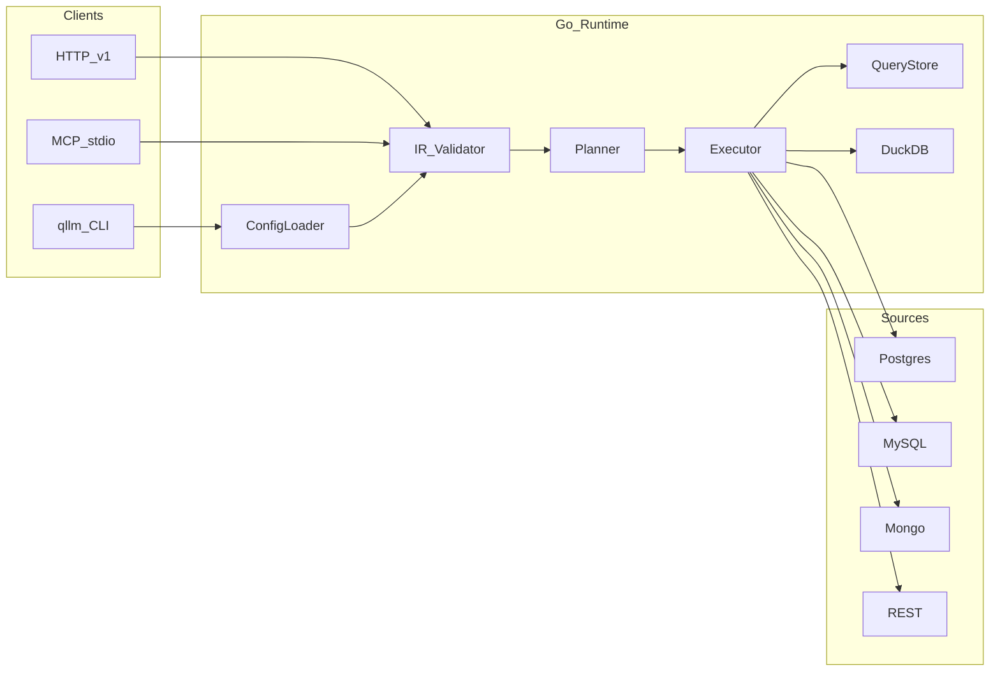

# Plano de implementação qLLM

Fonte de verdade já existente: [planning/03-protocol-schemas.md](planning/03-protocol-schemas.md), [planning/schemas/](planning/schemas/), [planning/01-decisions.md](planning/01-decisions.md), [planning/06-roadmap.md](planning/06-roadmap.md).

**Escopo MVP:** binário `qllm` + harness K8s + HTTP/MCP. **Fora do MVP:** clients Python/Node (Fase 6), introspecção automática de schema, optimizer federado.

**Default técnico travado:** embed DuckDB (`go-duckdb`); HTTP com `net/http` (Go 1.22+); CLI com `cobra`; YAML `gopkg.in/yaml.v3`; validação JSON Schema com `santhosh-tekuri/jsonschema/v5`; drivers `pgx`, `go-sql-driver/mysql`, `mongo-driver`; MCP via `github.com/mark3labs/mcp-go`.

---

## Estado atual

- Specs, ADRs, JSON Schemas 0.1.0, rules/skills: prontos
- Código: só [go.mod](go.mod) (`module qLLM`, Go 1.24.5)
- Atualizar [planning/06-roadmap.md](planning/06-roadmap.md) Fase 0 (schemas/rules já feitos) no início da execução

---

## Arquitetura alvo



---

## Layout de pacotes (criar)

```text
cmd/qllm/main.go
internal/config/          # resolve --config-dir|--project|--preset/--catalog; load YAML/JSON
internal/protocol/        # structs espelhando schemas 0.1.0 + error codes
internal/validate/        # JSON Schema + regras semânticas (alias, AMBIGUOUS_*)
internal/catalog/         # index name/aliases → entity; enrich capabilities
internal/planner/         # pushdown vs DuckDB; budget
internal/executor/        # orquestra steps, cancel, meta.plan
internal/result/          # tabular columns/rows
internal/querystore/      # in-memory queryId → status/result (TTL curto)
internal/connector/       # interface + postgres/mysql/mongodb/rest
internal/duckdb/          # materialize + SQL local join/agg
internal/httpserver/      # /v1/health|catalog|queries
internal/mcpserver/       # describe_catalog, execute_query, get_query
deploy/dev/               # K8s manifests Rancher
fixtures/                 # seeds, test-api Python, presets, golden IRs
scripts/                  # seed, port-forward, golden runner
```

Contrato de connector (único ponto de I/O):

```go
type Connector interface {
  Capabilities() Caps
  Query(ctx context.Context, step PushdownStep) (Tabular, error)
}
```

---

## Fase A — Foundation (skeleton + validação)

1. CLI `qllm`: `validate`, `query`, `serve` (`--http` / `--mcp`)
2. Discovery de config (ordem D13): flags → project file → `--config-dir` → CWD
3. Structs + unmarshal YAML/JSON; validar contra [planning/schemas/](planning/schemas/)
4. Validação semântica: entity/alias resolve, bindings únicos, `AMBIGUOUS_FIELD` / `AMBIGUOUS_ALIAS`, limit vs `maxLimit`
5. `GET /v1/health`, `GET /v1/catalog` (sem connectors)
6. Testes table-driven em `internal/validate`

**Exit:** IR/preset/catalog inválidos falham com códigos tipados; config ausente → `CONFIG_ERROR`.

---

## Fase B — Harness Rancher (em paralelo cedo)

Conforme [planning/05-dev-harness.md](planning/05-dev-harness.md):

- Namespace `qllm-dev`: Postgres, MySQL, MongoDB, `test-api` (FastAPI Python)
- Seeds correlacionados por `customer_id` / `customerId`
- `fixtures/presets/qllm.preset.yaml` + `qllm.catalog.yaml` (entity names distintos; 2 REST resources se útil para alias)
- Scripts: apply, seed, port-forward, export `QLLM_*`
- Fixture de timeout (API sleep > budget)

**Exit:** `kubectl apply` + seed deixa backends healthy; preset aponta para localhost via port-forward.

---

## Fase C — Postgres + MySQL + execute sync

1. Implementar pushdown: filter/project/agg/groupBy/orderBy/limit ([planning/04-connectors.md](planning/04-connectors.md))
2. Timeouts: `min(sourceTimeout, limits.maxSourceMs)` + cancel no `context`
3. `POST /v1/queries` sync → tabular + `meta.plan`
4. `qllm query -f ir.json`
5. Golden IRs: single-source pg, single-source mysql, agg

**Exit:** goldens <15s; `TIMEOUT` cancelável com source lenta.

---

## Fase D — Mongo + REST + DuckDB

1. Mongo: filter/project/limit + agg pipeline básica
2. REST: resources do preset (`list` / `getById`); filter→query params; agg/join → fetch limitado + DuckDB
3. Planner: cross-source join / unsupported pushdown → DuckDB; `meta.plan.usedDuckDB: true`
4. Goldens: `invoices ⋈ customers`, `events ⋈ customers`, REST+SQL; IR com `as` (`cu`/`eu`)

**Exit:** joins cross-source corretos; REST não faz full-scan (UNSUPPORTED se impossível com limit).

---

## Fase E — Async shape + MCP + hardening

1. `mode: async` → `202` + `queryId`; `GET /v1/queries/{id}` + `/result`; store in-memory TTL ~2min; **mesmo budget 15s**
2. MCP stdio: `describe_catalog`, `execute_query`, `get_query`
3. Read-only + allowlist enforcement tests
4. Logs estruturados: `queryId`, `elapsedMs`, `source`, `error.code`
5. README curto: “novo projeto em 5 minutos” (preset/catalog/env/serve)

**Exit:** agente local via MCP consulta catalog e executa IR.

---

## Fase F — Depois do MVP (não bloquear)

- Clients thin Python/Node sobre HTTP
- OpenAPI gerada a partir dos schemas
- Reload de config sem restart (se doer)

---

## Ordem de execução recomendada

1. Foundation (A)
2. Harness mínimo pg+mysql (B parcial) enquanto C avança
3. Connectors SQL (C)
4. Completar harness mongo+api (B)
5. Mongo/REST/DuckDB (D)
6. HTTP async + MCP + docs (E)

---

## Critérios de pronto do projeto (MVP)

- Contratos 0.1.0 implementados sem drift (mudança de wire → atualiza `planning/` primeiro)
- 4 tipos de source configuráveis via YAML; N instâncias do mesmo tipo
- Alias de catalog + `as` no IR funcionando
- Fail-fast ~15s com erros tipados
- Harness Rancher reproduzível + ≥3 goldens + 1 timeout
- HTTP `/v1` + MCP com as 3 tools

---

## Risco principal

Drift protocolo ↔ código. Mitigação: testes que validam fixtures contra JSON Schema; rule/skill `qllm-protocol` / `qllm-spec-change` em qualquer mudança de shape.
