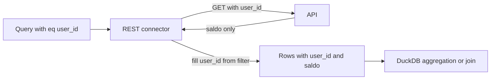

# REST: fields the API does not return (`fromFilter`)

## Problem

In [internal/connector/rest/rest.go](internal/connector/rest/rest.go) each cell is read as `row[i] = item[phys]`. If the API body is `{"saldo":5300}`, the `user_id` column becomes `null`. REST does not push aggregations, so aggregation runs locally and `GROUP BY user_id` collapses everything into one `null` group; joins on `user_id` also fail.

## Solution

A field flag in the catalog says "the API does not return this; its value is the one I filtered on":

```yaml
entities:
  - name: balance
    source: bank_api
    binding: { kind: resource, resource: balance }
    fields:
      - name: user_id
        type: string
        fromFilter: true      # filled from the eq filter, not from the response
      - name: saldo
        type: number
```

Flow: `WHERE user_id = '42'` -> `GET /balance?user_id=42` (or `/balance/42` via `getById`) -> body `{"saldo":5300}` -> row `{user_id: "42", saldo: 5300}`.



## Behavior rules

- Only **top-level AND of eq** filters can feed the fill. Values under `or`, `not`, or non-eq ops cannot (note `walkEq` today flattens `or` into the same map, which is wrong for this purpose; the fill must use a stricter extractor).
- If a `fromFilter` field is selected (or used in group by / join) but there is no eq on it: return a typed error (reuse `INVALID_IR`, message "field user_id is not returned by the source; filter it with eq") rather than null silently.
- If the API **does** return the field in the body, the body wins only if present and equal; if it differs from the filter, return `SOURCE_ERROR` (API ignored the filter or leaked another record). This doubles as a safety check for the scoped-keys plan.
- Filled value is cast to the field's logical type (`string` / `number`) so DuckDB grouping and joins type-match other sources.
- Scope: REST only for now (other key-addressed connectors such as DynamoDB, Redis already require `eq` on the key; extending later is easy).

## Work breakdown

- Spec first: add `fromFilter` (bool) to field in [planning/schemas/catalog.schema.json](planning/schemas/catalog.schema.json) (mirror to `internal/validate/schemas/`), document in `03-protocol-schemas.md` / `04-connectors.md`, add a short decision (next D number) in [planning/01-decisions.md](planning/01-decisions.md).
- Types: add `FromFilter bool` to `Field` in [internal/protocol/types.go](internal/protocol/types.go).
- Validation: `fromFilter` allowed only on entities whose source type is REST; reject otherwise with `CONFIG_ERROR`.
- Connector: in `Query` of [internal/connector/rest/rest.go](internal/connector/rest/rest.go), build a strict top-level eq map (logical field -> value); when projecting, for fields with `FromFilter` use that value (cast by type) instead of `item[phys]`; apply the equal/mismatch check when the body also carries the field.
- Planner: make sure fields used only in `where` but selected via `fromFilter` still reach the connector step ([internal/planner/planner.go](internal/planner/planner.go) `filterWhereForBinding`), and that the `where` on a `fromFilter` field is not dropped before the connector.
- Tests in [internal/connector/rest/rest_test.go](internal/connector/rest/rest_test.go): body without key + eq filter -> field filled; no eq -> typed error; `or` filter -> error; body with differing value -> `SOURCE_ERROR`; end-to-end aggregation `GROUP BY user_id` over two fetched users yields two groups (with a join to another entity for the join case).
- Docs: README REST sentence, [CHANGELOG.md](CHANGELOG.md) `Added`, `docs/*/connectors.md` and `field-reference.md` in 4 languages.

## Notes

- Not a general computed-column feature; only echoes a filter the caller already supplied, so it adds no new trust assumption. The server remains responsible for actually filtering by that param.
- Relation to the scoped-keys plan: the forced scope predicate is an eq filter, so a `fromFilter` scope column is filled automatically; the equality check above is the only post-fetch verification possible for APIs that omit the field.
