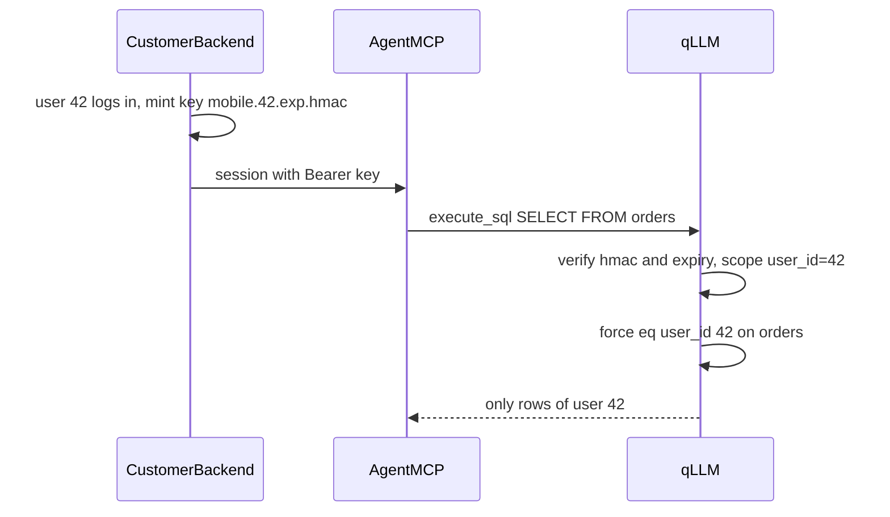

# Scoped keys: the user is baked into the key, not into the query

The credential itself carries the scope. The model never sees or writes it, and the query tools (`execute_sql`, `POST /v1/queries`, MCP) get **no new field**.

## Implementation guardrail (read first)

**Do NOT create one `apps[]` entry per end user.** `qllm.access.yaml` holds one entry per app TYPE or profile (for example `mobile`, `support`, `admin`). The per-user value (the user code) lives only inside the key minted at runtime by the customer's backend. Adding user 43 must require no YAML change and no restart.

## Config shape (primary: app template)

```yaml
# qllm.access.yaml
apps:
  - name: mobile                      # one template for ALL end users of this app
    tables: [orders, profile, products]
    scope:
      field: user_id                  # name of the scope value carried by the key
    keySecret: ${QLLM_MOBILE_SECRET}  # verifies derived keys; held only by backend + qLLM

  - name: admin                       # no scope: sees everything, as today (D16 allowlist only)
    key: ${QLLM_ADMIN_KEY}
    tables: ["*"]
```

```yaml
# qllm.catalog.yaml
entities:
  - name: orders
    source: shop_pg
    scope: { field: user_id }         # owned by scope.user_id; filter applied on this column
    binding: { kind: table, schema: public, table: orders }
  - name: products                    # no scope: shared table, never filtered
    source: shop_pg
    binding: { kind: table, schema: public, table: products }
```

Rules:
- `scope.field` on the app is the scope key name. An entity's `scope.field` maps that name to the entity's column (same name by default; entity may declare `column` if it differs).
- `key` (literal/env) and `keySecret` are mutually exclusive on one app. `key` = fixed static key; `keySecret` = derived keys.

## Derived key format

```
<app>.<scopeValue>.<expiryUnix>.<hmac>
mobile.42.1767225600.<base64url(HMAC-SHA256(keySecret, "mobile.42.1767225600"))>
```

- Backend mints it per login/session and passes it as `Authorization: Bearer <key>` (HTTP and MCP over HTTP).
- qLLM: split, look up the app template by the prefix, verify the HMAC in constant time (reuse [internal/cryptox/token.go](internal/cryptox/token.go)), reject if expired, read the scope value.
- `scopeValue` charset restricted to `[A-Za-z0-9_-]`, bounded length. Reject anything else. The value is applied as a typed `eq` value, never concatenated into text.
- Short expiry is the revocation story (minutes to hours). Rotating `keySecret` invalidates all keys for that app. A denylist is out of scope for now.
- stdio MCP has no header: scope comes from process env (analogous to `QLLM_APP`; for example `QLLM_SCOPE`).

## Static variant (exception, not the default)

Only for a few fixed, long-lived principals such as one partner. One entry per principal with a fixed scope:

```yaml
- name: partner-acme
  key: ${QLLM_ACME_KEY}
  tables: [orders]
  scope: { user_id: "acme" }   # literal value here; contrast with scope.field in the template
```

Docs must present the template as the main path and this as the exception.

## Runtime behavior

1. Auth resolves the key to an `App` plus a `Scope` map and stores it in `appctx` ([internal/appctx/ctx.go](internal/appctx/ctx.go) already carries `*access.App`; auth entry is [internal/serveauth/auth.go](internal/serveauth/auth.go)).
2. IR and `execute_sql` both end in [internal/executor/executor.go](internal/executor/executor.go). On every step for a scoped entity, qLLM appends `eq(column, scopeValue)` using the value from the key, never the query text.
3. Cases:
   - `SELECT * FROM orders` runs as `... WHERE user_id = '42'`.
   - `... WHERE user_id = '42'`: same, no duplicate predicate.
   - `... WHERE user_id = '7'`: `FORBIDDEN_SCOPE` (default `scopeMode: reject`) or forced `AND` wins with empty result (`scopeMode: inject`).
   - Joins: each scoped entity gets its own predicate.
   - Scoped entity but key carries no scope value: refuse, never fall back to unscoped.
   - App without `scope`, or entity without `scope`: behaves exactly as today. Mixed apps are fine (scoped `orders`, shared `products`).



## Validation

`qllm validate` fails when an app with `scope` lists a table whose entity has no `scope` and is not listed in `unscopedTables` (explicit shared tables). Also: `scope.field` required when `keySecret` is set; `key` and `keySecret` not both set.

## Limits (state honestly in docs)

- Only as good as the catalog: an entity without `scope` is not protected (hence the validate rule).
- Columns inside allowed rows stay visible (hide via catalog fields).
- The source account still reads everything. Keep Postgres RLS or a view as a second layer.

## Alternative (later, optional)

`sessionVars` on a source: Postgres `SET LOCAL app.user_id = '<scope>'` before the SELECT, so database RLS enforces it. Only for Postgres/MySQL-class sources.

## Work breakdown

- Spec first: D20 in [planning/01-decisions.md](planning/01-decisions.md); entity `scope` in catalog schema; app `scope`/`keySecret`/`unscopedTables` in [planning/schemas/access.schema.json](planning/schemas/access.schema.json) (mirror into `internal/validate/schemas/`); `FORBIDDEN_SCOPE` error; derived key format in `03`.
- Code: parse/validate in [internal/access/access.go](internal/access/access.go) and catalog loader (template resolution by key prefix, HMAC + expiry verify); carry scope in `appctx`; inject/reject in the executor where the per-entity step is built; `validate` rule.
- Tests: spoofed filter for another user (reject and inject modes), join, missing scope, expired key, tampered HMAC, bad charset, app without scope unchanged, adding a new user needs no config change.
- Docs: README, CHANGELOG, `docs/*/field-reference.md` and a short "multi-user safety" page in 4 languages.
