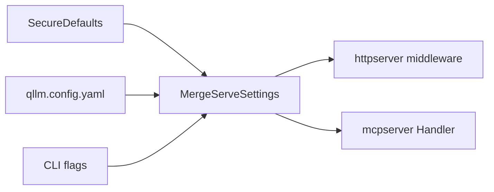

# Security fixes + `qllm.config.yaml`

## Design decisions (locked)

- **New runtime file** `qllm.config.{yaml|yml|json}` — sibling to preset/catalog under `--config-dir` / CWD (or explicit `--runtime-config`). **Not** part of the Query IR / preset data-plane contract; keep secrets out of the file (token via env name only).
- **Precedence:** built-in secure defaults → runtime config file → CLI flags (flags win when explicitly set).
- **Defaults when no file / unset fields:**
  - Listen: `127.0.0.1:8088` (HTTP), `127.0.0.1:8089` (MCP HTTP)
  - Auth: off unless `authTokenEnv` resolves to a non-empty value
  - CORS: **off** (no ACAO headers); `origins: ["*"]` rejected at load
  - Non-loopback bind without auth requires `insecureBind: true` or `--insecure-bind`, else refuse start
- **Auth:** shared Bearer token for HTTP `/v1` and MCP HTTP; header `Authorization: Bearer <token>`. Stdio MCP unchanged (process-local).
- **Postgres TLS default** in code becomes `require` when `sslMode` omitted; fixtures keep `sslMode: disable`.

## Runtime config shape

New schema [`planning/schemas/runtime-config.schema.json`](planning/schemas/runtime-config.schema.json) + Go type in [`internal/protocol/types.go`](internal/protocol/types.go) (or `internal/runtimeconfig`).

```yaml
# qllm.config.yaml (optional)
serve:
  addr: "127.0.0.1:8088"
  mcpAddr: "127.0.0.1:8089"
  authTokenEnv: "QLLM_AUTH_TOKEN"   # env holds the secret
  insecureBind: false
  maxBodyBytes: 1048576             # HTTP request body
  maxRestResponseBytes: 10485760    # REST connector response
  cors:
    origins: []                     # empty = disabled; allowlist only
    allowHeaders:
      - Content-Type
      - Accept
      - Mcp-Session-Id
      - Authorization
    allowMethods: [GET, POST, DELETE, OPTIONS]
```

Wire-up in [`internal/config/load.go`](internal/config/load.go): optional `findNamed(..., "qllm.config")` in `LoadBundle` / new `LoadRuntimeConfig`; merge helper used by `serve` in [`cmd/qllm/main.go`](cmd/qllm/main.go).



## Spec updates (before / with code)

Per project rules and `qllm-spec-change`:

- Add **D14** in [`planning/01-decisions.md`](planning/01-decisions.md): runtime serve config file vs preset.
- Document layout + fields in [`planning/03-protocol-schemas.md`](planning/03-protocol-schemas.md) and [`planning/02-architecture.md`](planning/02-architecture.md).
- Note MCP CORS/auth/bind in README serve section ([`README.md`](README.md)).
- Catalog identifier patterns in [`planning/schemas/catalog.schema.json`](planning/schemas/catalog.schema.json) (+ mirrored validate schema if duplicated).
- No Query IR `protocolVersion` bump (runtime config is additive tooling).

---

## Implementation workstreams

### 1. Serve lockdown (P0) + config-driven CORS/auth/bind

| Change | Where |
|--------|--------|
| Secure default addrs | [`cmd/qllm/main.go`](cmd/qllm/main.go) flag defaults → `127.0.0.1:8088` / `127.0.0.1:8089` |
| `--insecure-bind`, `--auth-token-env`, `--runtime-config`, optional `--cors-origin` (repeatable or comma) | same |
| Auth middleware | shared helper (e.g. `internal/serveauth`) wrapping both HTTP and MCP muxes; 401 JSON/`UNAUTHORIZED` when token configured and missing/wrong |
| CORS from config | replace hardcoded `*` in [`internal/mcpserver/server.go`](internal/mcpserver/server.go) `withCORS`; update [`server_test.go`](internal/mcpserver/server_test.go) |
| Bind policy | parse host; if not loopback and no auth token and `!insecureBind` → exit with clear error |

### 2. Enforce product claims (P1)

| Change | Where |
|--------|--------|
| `readOnly` | At REST `Query`: if preset `limits.readOnly` and method ∉ `{GET,HEAD}` → `FORBIDDEN`. At startup validate: warn/error if readOnly + mutating resource methods in preset. SQL stays SELECT-only via existing builder. |
| `statementTimeoutMs` | [`internal/connector/sqldb/sql.go`](internal/connector/sqldb/sql.go): Postgres `options=-c statement_timeout=N` (or session SET after open); MySQL `SET SESSION max_execution_time=...` where applicable; take `min(option, maxSourceMs)` per [`planning/04-connectors.md`](planning/04-connectors.md) |
| Body caps | HTTP: `http.MaxBytesReader` in createQuery using `serve.maxBodyBytes`. REST: cap `io.ReadAll` with `maxRestResponseBytes` from runtime config passed into connector open or client |

### 3. Connector hardening (P2)

| Change | Where |
|--------|--------|
| Safer DSN | Postgres: `pgx.ParseConfig` / `ConnConfig` fields; MySQL: `mysql.Config{...}.FormatDSN()` — stop `fmt.Sprintf` password into string |
| Scrub errors | Map driver errors to `SOURCE_ERROR` without echoing password/DSN; generic message + source id |
| TLS defaults | Postgres default `sslMode` → `require`; MySQL optional `tls` connection key (default off for harness; document) |
| Mongo `$regex` | [`internal/connector/mongo/mongo.go`](internal/connector/mongo/mongo.go): `regexp.QuoteMeta` on contains value |
| LIKE wildcards | [`internal/connector/sqlbuild/build.go`](internal/connector/sqlbuild/build.go): escape `%` / `_` in contains bound values |

### 4. Config paths, catalog, deps (P3)

| Change | Where |
|--------|--------|
| Path confinement | [`internal/config/load.go`](internal/config/load.go) `resolveProject`: after `Clean`/`Abs`, require resolved preset/catalog under project base |
| Catalog identifiers | Schema pattern for `schema`/`table`/`collection`/`resource`/`physical` (SQL-safe + `schema.table` for physical); validate fixtures still pass |
| Drop unused DuckDB | Remove `github.com/duckdb/duckdb-go/v2` from [`go.mod`](go.mod) / `go.sum` (local engine remains pure Go) |
| Harness docs only | Note insecure defaults in README/`deploy/dev` comments — no secret rotation in this pass |

### 5. Tests & docs

- Unit: runtime config load/merge; bind policy; auth middleware; CORS allowlist vs disabled; path escape rejection; Mongo QuoteMeta; LIKE escape; readOnly FORBIDDEN.
- Update MCP CORS test (no longer expect `*`).
- Example [`fixtures/`](fixtures/) optional `qllm.config.yaml` for local serve (loopback, CORS off).
- README: auth header example, config file, insecure-bind warning.

## Out of scope (explicit)

- mTLS / OAuth for serve
- Rate limiting beyond body size caps
- Changing Query IR or adding per-table tools
- Regenerating harness DB passwords
