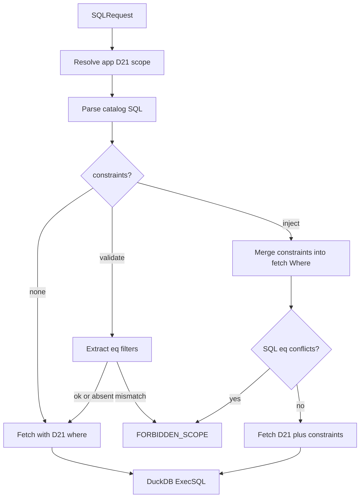

# SQL request constraints (validate + inject)

## Intent (locked)

- Caller may pass JSON `{ field: value }` on the SQL request.
- Default: if SQL already filters that field and the value differs → **abort**.
- Optional mode: **always** apply those eqs on source fetch so bare `SELECT *` cannot list everyone.
- **D21 Bearer scope stays the strong path** and **wins** when both are present.
- Extend `execute_sql` (optional args) — **no** fourth MCP tool (`enforced_sql_query`), keeping D06 three-tool surface.

## Why not replace D21

D21 binds the subject to the credential so the model cannot swap `user_id`. Request constraints are a **convenience / defense-in-depth** layer for simpler setups and for hosts that already know the subject (LangGraph, BFF). Docs will say: bind the map in the host when possible; do not ask the LLM to invent it.

## Contract (spec first)

Add decision **D23** in [planning/01-decisions.md](planning/01-decisions.md); update [planning/03-protocol-schemas.md](planning/03-protocol-schemas.md) and [planning/schemas/sql-request.schema.json](planning/schemas/sql-request.schema.json):

Request shape:

- `sql` (required), `version` (optional) — unchanged
- `constraints` — object of catalog field name → scalar (string/number/boolean)
- `constraintMode` — `validate` (default when constraints non-empty) or `inject`

Semantics:

- **validate**: extract equality filters on constrained fields from SQL; mismatch → `FORBIDDEN_SCOPE`; field absent from WHERE → allow (documented footgun)
- **inject**: AND those eqs onto each relevant entity source fetch (same hook as today’s SQL scope in [internal/executor/sql.go](internal/executor/sql.go)); conflicting SQL equality → abort
- Unknown constraint key → typed invalid error
- **D21 precedence**: if credential scopes field F to Vcred, constraint F must equal Vcred or `FORBIDDEN_SCOPE`; other keys still apply
- Amend D21 text: tools gain no *required* subject field; optional `constraints` are additive and do not replace credential scope
- HTTP and MCP stay in parity

## Runtime

Code touchpoints:

- [internal/protocol/sql.go](internal/protocol/sql.go) — extend `SQLRequest`
- Mirror schema under `internal/validate/schemas/` if used by validate
- [internal/sqlparse/](internal/sqlparse/) — collect simple AND-chain equality literals for named fields (document limits under OR/subqueries)
- [internal/executor/sql.go](internal/executor/sql.go) — validate/inject + fold into fetch Where
- [internal/mcpserver/server.go](internal/mcpserver/server.go) + [descriptions.go](internal/mcpserver/descriptions.go) — optional `constraints`, `constraintMode`
- [internal/httpserver/server.go](internal/httpserver/server.go) — decode new fields

## Tests

Mismatch abort; inject filters fetch; D21 + conflicting constraint; unknown field; MCP/HTTP decode smoke.

## Docs / changelog

- [docs/en/multi-user-safety.md](docs/en/multi-user-safety.md) (+ pt/es/zh): constraints vs scoped keys; warn validate alone does not stop unfiltered selects
- [docs/en/http-mcp.md](docs/en/http-mcp.md), [docs/en/field-reference.md](docs/en/field-reference.md) (+ locales)
- [site/security.html](site/security.html) and/or [site/query.html](site/query.html): short note
- [CHANGELOG.md](CHANGELOG.md) Unreleased; one README line if operator-visible

## Product guidance

- D21 derived Bearer — real multi-tenant; LLM never sees subject
- `constraintMode: inject` — trusted host knows subject; simple JSON without HMAC keys
- `constraintMode: validate` — extra check that a filter the model wrote matches host intent; not enough alone

Recommended host pattern: authenticate user in the app → set constraints/inject server-side → model only supplies `sql`.
