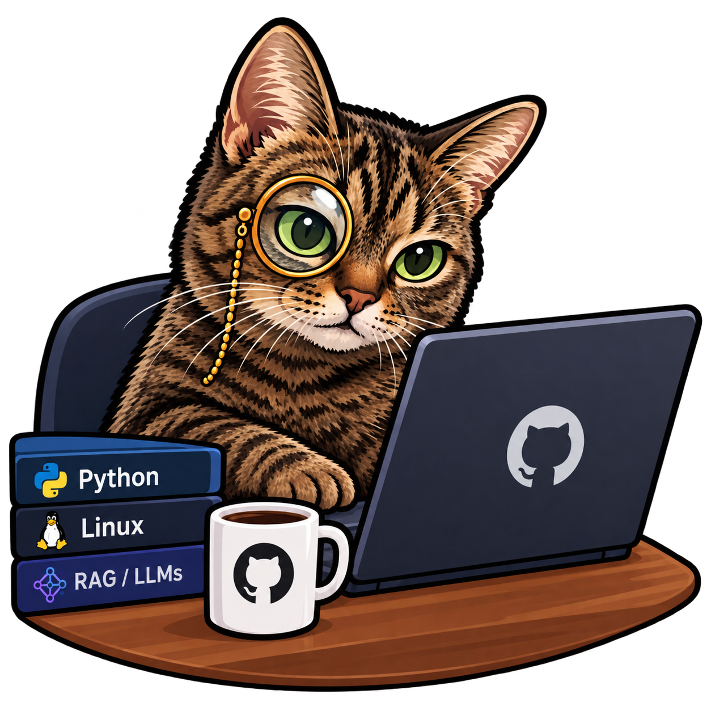

# qLLM

<p align="center">
  
</p>

Multi-source query runtime (Go). Configure sources with YAML preset + logical catalog, query via JSON IR, serve HTTP `/v1` or MCP.

Protocol **0.2.0** (0.1.0 files remain valid) — see [planning/](planning/) (contracts) and [CHANGELOG.md](CHANGELOG.md).

## Why qLLM

Most organizations keep their data in many places: several databases, internal APIs, event streams. Access to those sources is usually **limited on purpose**. Teams expose a few database views or a handful of API endpoints, not the full schema, and nobody wants to hand an LLM raw credentials or free-form SQL.

Yet an LLM (or an agent) is far more useful when it can talk to that data and run queries over it. qLLM is the missing layer between the two:

- **One governed surface.** You describe sources in a YAML preset, and describe *only* the views, endpoints, and fields you want visible in a logical catalog. The LLM sees the catalog, nothing else.
- **Read-only and bounded.** Row limits are required and capped, queries fail fast (~15 s budget), and secrets stay in environment variables.
- **Queries across sources.** Filters and limits are pushed to each source; when a join spans sources, a small local DuckDB step finishes the work.
- **Standard access.** The agent uses HTTP `/v1` or MCP (`how_to_use_me`, `describe_catalog`, `execute_sql`), so any MCP-capable client works without custom code.

It is a query runtime, not a data warehouse: slow sources are out of scope.

## How it works

```text
preset.yaml  +  catalog.yaml  →  validate  →  HTTP /v1  or  MCP
                                      ↓
                         Query IR  or  catalog SQL
                                      ↓
              pushdown to each source  →  optional local join (DuckDB)
```

You write two project files: which sources exist (`qllm.preset.yaml`) and which logical tables the agent may see (`qllm.catalog.yaml`). The runtime never exposes raw source SQL as the agent API.

## Documentation

Pick the folder for your language. Each one has the same 13 guides, including writing your YAML from zero (`from-scratch.md`) and the full field list (`field-reference.md`).

| Language | Docs |
|----------|------|
| English | [docs/en/](docs/en/README.md) |
| Português | [docs/pt/](docs/pt/README.md) |
| Español | [docs/es/](docs/es/README.md) |
| 中文 | [docs/zh/](docs/zh/README.md) |

Connection keys and the capability matrix live in [planning/04-connectors.md](planning/04-connectors.md).

## Supported connectors

Harness / CI covers **postgres**, **mysql**, **mongodb**, and **rest**. Everything else is in the binary but has no Compose setup or goldens — test it against your own instance.

| `type` | Status | Pushdown | Notes |
|--------|--------|----------|-------|
| `postgres` | stable | filter, project, agg, groupBy, order, limit, same-source join | `sslMode`; `statementTimeoutMs` |
| `mysql` | stable | same as postgres | |
| `mongodb` | stable | filter, project, agg, groupBy, order, limit | same-source join goes through DuckDB |
| `rest` | stable | `eq` filter, project, limit/offset | `options.resources` required; aggregations in DuckDB; optional `getById`, `itemsKey`, offset pagination |
| `mssql` | experimental | same as postgres | `encrypt` |
| `sqlite` | experimental | same as postgres | `pathEnv`; `binding.schema: main` |
| `clickhouse` | experimental | same as postgres | native port is typically 9000 |
| `dynamodb` | experimental | key equality, project, limit | `binding.accessPath` pk/sk required or `UNSUPPORTED` |
| `cassandra` | experimental | partition equality, project, limit | `accessPath.partition` required or `UNSUPPORTED` |
| `ksql` | experimental | key equality, project, limit | **pull only**; `accessPath.ksqlKey` required or `UNSUPPORTED` |
| `redis` | experimental | key equality, project, limit | `binding.kind: key` + `keyPattern`; GET/HGETALL/LRANGE/SSCAN/ZRANGE/XRANGE only; never deletes, pops, or `KEYS` |
| `kafka` | experimental | partition+offset / key / time | `binding.kind: topic`; no consumer group, no offset commit; JSON/raw values; never produces |

Wire-compatible aliases (same driver and connection shape as the parent; experimental, no harness):

| Parent | Alias `type` values |
|--------|---------------------|
| `mysql` | `mariadb`, `tidb`, `vitess`, `aurora_mysql`, `planetscale` |
| `postgres` | `cockroach`, `yugabyte`, `alloydb`, `aurora_postgres`, `neon`, `supabase`, `timescale`, `redshift` |

Redshift and Cockroach may need extra dialect work for introspection; `qllm catalog introspect` still only talks the parent wire protocol (postgres or mysql).

Not a source type: Oracle, BigQuery, Snowflake, Elasticsearch, GraphQL, S3-as-table. Many HTTP JSON APIs are already reachable as `rest` plus `from-openapi`.

## Quick start (5 minutes)

### 1. Build

```bash
go build -o qllm ./cmd/qllm
```

### 2. Project files

```text
my-project/
  qllm.preset.yaml    # sources + *Env secrets
  qllm.catalog.yaml   # logical entities
  qllm.config.yaml    # optional: bind, auth, CORS, body caps
  qllm.access.yaml    # optional: apps, keys (${ENV} or literal), tables
```

Set the env vars named in the preset (`QLLM_*`). Without YAML in `--config-dir` (or CWD), serve fails with `CONFIG_ERROR`. Compose and `fixtures/` only start test DBs and the fake API — they are not the catalog.

```bash
./qllm validate --config-dir ./my-project
./qllm serve --http --config-dir ./my-project
```

Defaults listen on **`127.0.0.1:8088`** (HTTP) and **`127.0.0.1:8089`** (MCP HTTP). Non-loopback bind without auth requires `--insecure-bind` or `serve.insecureBind: true`.

Draft a catalog from a live SQL source or an OpenAPI file (review before serve):

```bash
./qllm catalog introspect --source crm_pg --config-dir ./my-project --out ./my-project/qllm.catalog.yaml
./qllm catalog from-openapi -f ./other-team.yaml --source legacy_api --config-dir ./my-project --out ./draft.catalog.yaml --resources-out ./draft.resources.yaml
```

### 3. First query

```bash
curl -s http://127.0.0.1:8088/v1/howtouseme | jq .
curl -s http://127.0.0.1:8088/v1/catalog | jq .
curl -s -X POST http://127.0.0.1:8088/v1/queries -d @fixtures/queries/customers_list.json
```

`GET /v1/howtouseme` is the closed Query IR contract for LLMs (`never`, where shapes, invalidExamples). Call it before inventing queries.

```bash
./qllm query --config-dir ./deploy/image/config -f ./fixtures/queries/customers_list.json
```

## Configuration

Secrets in `qllm.env.yaml` should be `${QLLM_…}`; set the same names in the process or compose `environment:`. Process env wins if already set.

### Runtime file (`qllm.config.yaml`)

Optional sibling file (schema: [planning/schemas/runtime-config.schema.json](planning/schemas/runtime-config.schema.json)). Precedence: secure defaults → file → CLI flags.

```yaml
serve:
  addr: "127.0.0.1:8088"
  mcpAddr: "127.0.0.1:8089"
  authTokenEnv: "QLLM_AUTH_TOKEN"
  insecureBind: false
  maxBodyBytes: 1048576
  maxRestResponseBytes: 10485760
  cors:
    origins: []   # empty = CORS off; wildcard * rejected
```

Flags: `--runtime-config`, `--addr`, `--mcp-addr`, `--auth-token-env`, `--insecure-bind`, `--cors-origin` (repeatable).

### Auth (optional)

Set `serve.authTokenEnv` in `qllm.config.yaml` (or `--auth-token-env`) to an env var that holds the shared Bearer token for HTTP `/v1` and MCP HTTP. If the env name is set, the variable **must** be non-empty or serve refuses to start. Stdio MCP is unaffected.

```bash
export QLLM_AUTH_TOKEN=dev-secret
# qllm.config.yaml: serve.authTokenEnv: QLLM_AUTH_TOKEN
curl -s -H "Authorization: Bearer $QLLM_AUTH_TOKEN" http://127.0.0.1:8088/v1/catalog
```

`GET /v1/health` stays unauthenticated for probes.

Optional `qllm.access.yaml` replaces the single Bearer token. Each app has a `key` (literal or `${ENV_NAME}`) and `tables` from the catalog. HTTP/MCP HTTP use `Authorization: Bearer <key>`. MCP stdio uses `--app` / `QLLM_APP`.

```yaml
apps:
  - name: crm-agent
    key: ${QLLM_CRM_AGENT_KEY}
    tables: [customers, invoices]
```

## Serving

### HTTP

`./qllm serve --http --config-dir ./my-project` serves `/v1/howtouseme`, `/v1/catalog`, `/v1/queries`, `/v1/sql`, and `/v1/health`.

### MCP

Tools: `how_to_use_me`, `describe_catalog`, `execute_sql`. Each `execute_sql` writes a multiline block to stderr (`---- execute_sql ----` plus the SQL). MCP logs `---- mcp_tool ----` for the other two. Example: `kubectl logs -n qllm-prd deploy/qllm | findstr execute_sql`.

**STDIO** (Inspector local):

```bash
./qllm serve --mcp --config-dir ./deploy/image/config
```

**Streamable HTTP + SSE** (Jupyter / LangChain) — defaults to loopback; enable CORS allowlist only if a browser client needs it:

```bash
./qllm serve --mcp-http --config-dir ./deploy/image/config
# or together with REST:
./qllm serve --http --mcp-http --config-dir ./deploy/image/config
```

| Path | Transport |
|------|-----------|
| `http://127.0.0.1:8089/mcp` | Streamable HTTP (LangChain) |
| `http://127.0.0.1:8089/sse` | SSE (legacy Inspector) |

```python
# pip install langchain-mcp-adapters
from langchain_mcp_adapters.client import MultiServerMCPClient

client = MultiServerMCPClient({
    "qllm": {
        "transport": "streamable_http",
        "url": "http://127.0.0.1:8089/mcp",
    }
})
tools = await client.get_tools()
```

## Running with containers

Product [`Dockerfile`](Dockerfile) bakes [`deploy/prd/`](deploy/prd) into `/config`. Compose uses [`Dockerfile.dev`](Dockerfile.dev) + [`deploy/image/config`](deploy/image/config). `fixtures/` is not copied except as the `test-api` build context.

```bash
nerdctl compose up --build
```

HTTP: `Authorization: Bearer change-me`. Seed: `.\scripts\dev-seed-fake.ps1` loads `fixtures/datasets/v1` (add `--regenerate` only to rewrite the frozen JSON). Rebuild `test-api` if `fixtures/test-api/data.json` changed. SQL MCP goldens: `pytest fixtures/sqlcheck`.

Example project YAML (edit + `docker build`): [`deploy/prd/README.md`](deploy/prd/README.md).

Standalone image (same compose network / `--network`):

```bash
nerdctl build -t qllm .
nerdctl run --rm -p 8088:8088 -p 8089:8089 qllm
```

Optional **fleet-ops** Kubernetes sim: [`deploy/prd-tst/README.md`](deploy/prd-tst/README.md). Up: `.\scripts\prd-tst-up.ps1` / `./scripts/prd-tst-up.sh` (compose down + image + apply). Down: `.\scripts\prd-tst-down.ps1` / `./scripts/prd-tst-down.sh`. Then port-forward: `.\scripts\prd-tst-port-forward.ps1`. Do not run the sim together with compose. Goldens unchanged.

Compose DBs use weak passwords, open Mongo, and `sslMode: disable` for **local** use — do not publish those ports beyond localhost.

## Behavior

### Fail-fast

Default budget ~15s (`limits.maxSyncMs`). Slow sources return typed `TIMEOUT` — not something qLLM tries to “fix” for you.

### Local join engine

Default build uses the **pure Go** engine in `internal/duckdblocal` (no CGO). Cross-source joins, REST aggs, where (`and`/`or`/`not` + compare ops), offset, and composite join `on` run there.

### Optional embedded DuckDB (`-tags duckdb`)

Requires CGO + a C compiler. Same `Engine` API; `Open()` swaps implementation.

```bash
# Linux/macOS
CGO_ENABLED=1 go test -tags duckdb ./internal/duckdblocal/
CGO_ENABLED=1 go build -tags duckdb -o qllm ./cmd/qllm

# Windows — load gcc + duckdblib first
.\scripts\dev-shell.ps1
go test -tags duckdb ./internal/duckdblocal/
go build -tags duckdb -o qllm.exe ./cmd/qllm
go run -tags duckdb .\scripts\duckdb_smoke.go
```

Without `-tags duckdb`, `go test ./...` stays CGO-free.

## Development

Requires Go **1.26.6+** (`go.mod` / `toolchain go1.26.6` and image `golang:1.26.6-bookworm`). `mcp-go` is pinned at **v0.48.0**.

### Start a standalone repo

To host a working copy on GitHub or GitLab without this repo’s docs, fixtures, or harness:

```bash
python scripts/init-standalone.py --user Alice --out ..
# or: ./scripts/init-standalone.sh --user Alice --out ..
# or: .\scripts\init-standalone.ps1 --user Alice --out ..
```

That writes `../qllm-alice/` (Go runtime, `config/`, a tiny SQLite `data/app.db`, and a Dockerfile). Build and run there with Docker on Windows, Linux, or macOS.
